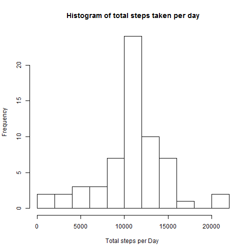
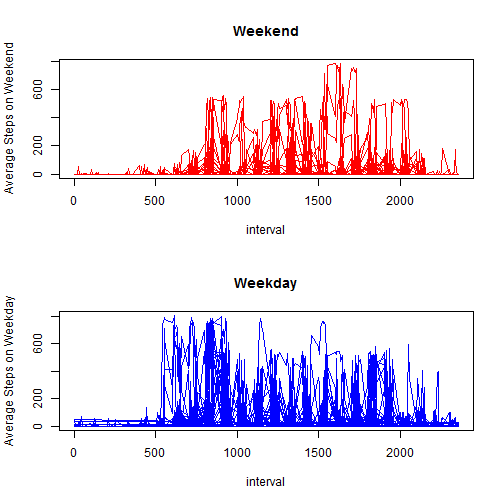

## Loading and preprocessing the data
This is Course Project 1 for Reproducible Research Course. This assignment is processing activity monitoring data and answering various questions related to the assignments.

First we read the csv file and remove all the rows which have steps values as NAs.

```r
library(dplyr)
activityDataInit <- read.csv("activity.csv")
activityData <- activityDataInit[complete.cases(activityDataInit),]
```

## What is mean total number of steps taken per day?
We use summarize to calculate the total number of steps and average number of steps per day.


```r
totalStepsperDay <- summarise(group_by(activityData, date), totalSteps = sum(steps, na.rm = "TRUE"))
meanStepsperDay <- summarise(group_by(activityData, date), meanSteps = mean(steps, na.rm = "TRUE"))
```
we plot the histogram of the total steps taken per day and also calculate the mean and median of the total number of steps taken per day.

```r
hist(totalStepsperDay$totalSteps, breaks = 10 ,xlab = "Total steps per Day ",  main = "Histogram of total steps taken per day")
```

 

```r
meanTotalSteps <- mean(totalStepsperDay$totalSteps)
medianTotalSteps <- median(totalStepsperDay$totalSteps)
```


```
## [1] "Mean number of steps taken per Day is"
## [2] "10766.1886792453"
```

```
## [1] "Median number of steps taken per Day is"
## [2] "10765"
```

## What is the average daily activity pattern?

We calculate the mean and the total number of steps per interval and also find out the interval which has the maximum total steps.We also plot a time series of the average number of steps per interval.  

```r
meanStepsperInterval <- summarise(group_by(activityData, interval),meanstepsInterval = mean(steps, na.rm = "TRUE"))
totalStepsperInterval <- summarise(group_by(activityData, interval), stepsInterval = sum(steps, na.rm = "TRUE"))
stepsHighestInterval <- totalStepsperInterval[which(totalStepsperInterval$stepsInterval == max(totalStepsperInterval)),]
plot(meanStepsperInterval$interval, meanStepsperInterval$meanstepsInterval , type = "l", xlab = "Interval", ylab = "Average number of Steps" , main = "Time series plot of average steps taken per Day"  )
```

 

```
## [1] "Interval with highest steps is" "835"
```

## Imputing missing values

In this part we calculate the total number of missing values in the dateset. All the missing values we replace with the average steps taken per interval. We then calculate the mean and median for the new data frame and also plot histogram for the total steps taken per day. It can be observed that the mean and median number of steps per day before imputing and after imputing are very close to each other.


```r
NAcount <- sum(is.na(activityDataInit$steps))
meanStepInterval <- mean(activityData$steps, na.rm = "TRUE")
activityDataImp <- transform(activityDataInit, newSteps = ifelse(is.na(steps),meanStepInterval , steps))
totalStepsperDay <- summarise(group_by(activityDataImp, date), totalSteps = sum(newSteps, na.rm = "TRUE"))

hist(totalStepsperDay$totalSteps, breaks = 10 ,xlab = "Total steps per Day ", main = "Histogram of total steps taken per day")
```

 

```r
meanTotalStepsImp <- mean(totalStepsperDay$totalSteps)
medianTotalStepsImp <- median(totalStepsperDay$totalSteps)
```


```
## [1] "Total number of rows with missing values are "
## [2] "2304"
```

```
## [1] "Mean number of steps taken per Day is"
## [2] "10766.1886792453"
```

```
## [1] "Median number of steps taken per Day is"
## [2] "10766.1886792453"
```

## Are there differences in activity patterns between weekdays and weekends?
We create a new factor variable weekday/weekend indicating whether the given day is weekday or weekend. We plot the mean steps per day for weekend and weekday and it can be observed that the activity on weekday is higher than that on a weekend.

```r
activityDataWeekday <- transform(activityDataImp, Day = ifelse(weekdays(as.Date(activityDataImp$date)) == "Saturday" | weekdays(as.Date(activityDataImp$date)) == "Sunday", "Weekend","Weekday"))  

par(mfrow = c(2, 1) )
plot(activityDataWeekday$interval[activityDataWeekday$Day!= "Weekday"],activityDataWeekday$steps[activityDataWeekday$Day!= "Weekday"], type = "l",xlab = "interval", ylab = "Average Steps on Weekend" ,col = "red" , main =  "Weekend")
plot(activityDataWeekday$interval[activityDataWeekday$Day== "Weekday"],activityDataWeekday$steps[activityDataWeekday$Day== "Weekday"], type = "l" , xlab = "interval", ylab = "Average Steps on Weekday" ,col = "blue" , main = "Weekday"  )
```

 
